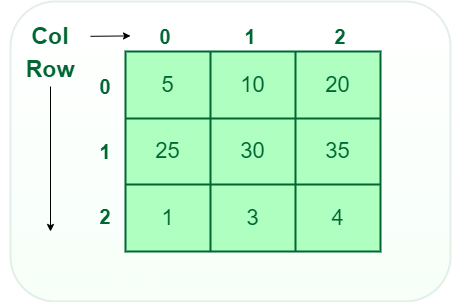

[**< Back**](/README.md)

# Array

- **It is a linear data structure**

The most basic yet important data structure is the array.An array is collection of same data types where the elements are allocated contiguous memory.Because of the contiguous allocation of memory, any element of an array can be accessed in constant time.
Each array element has a cor-responding index number.

```
    Array = 2  6  7  9
    Index = 0  1  2  3
```

## Types of arrays

1. **One-dimensional array (1-D arrays):** A one dimensional array, often simply referred to as a "1D array,".It is collection of element of the same data type, arranged in a linear sequence where each element is uniquely identified by an index or position.**_You can imagine a 1D array as row, where elements are stored one after another._**

   

   **Key characteristics of one-dimensional arrays:**

   1. Homogeneous Elements,
   2. Fixed or Dynamic Size,
   3. Index-Based Access,
   4. Linear Data Structure,

   ```javascript
   //example javascript one dimensional array
   const array = [1, 2, 3, 4, 5];
   ```

2. **Two-dimensional array (2-D arrays):** A one dimensional array, often simply referred to as a "2D array,".In a 2D array, elements are arranged in rows and columns, forming a grid-like structure.Each element in the 2D array is identified by its row and column indices.**_A 2D Multidimensional arrays can be considered as an array of arrays or as a matrix consisting of rows and columns._**

   

   **Key characteristics of Two-dimensional arrays:**

   1. Rectangular Grid,
   2. Homogeneous Elements,
   3. Index-Based Access,
   4. Matrix-Like Representation

   ```javascript
   //example javascript two dimensional array
   const array = [
     [10, 20, 30],
     [11, 22, 33],
     [66, 55, 44],
   ];
   ```

3. **Three-dimensional array (3-D arrays):** A one dimensional array, often simply referred to as a "3D array,". A three-dimensional array is a collection of two-dimensional arrays. It can be visualized as multiple 2D arrays stacked on top of each other.**_A 3-D Multidimensional array contains three dimensions, so it can be considered an array of two-dimensional arrays._**

   

   **Key characteristics of Three-dimensional arrays:**

   1. Cuboidal Structure,
   2. Homogeneous Elements,
   3. Index-Based Access,
   4. 3D Cubes or Volumes

   ```javascript
   //example javascript Three dimensional array
   const array = [
     [
       [10, 20, 30],
       [11, 22, 33],
       [66, 55, 44],
     ],
     [
       [13, 26, 39],
       [11, 12, 93],
       [46, 25, 64],
     ],
   ];
   ```

- **Some topic array**

  - **_Reverse Array_** - Reverse array means shifting the element of an array in a reverse manner,i.e.,the last element becomes the first element, second last element becomes the second element, and so on.

    ```
    Input  = 1  2  3  4
    Output = 4  3  2  1
    ```

    - **Javascript**

    ```javascript
    const array = [1, 2, 3, 4];

    // First Solution while loop
    function reverseArray(arr) {
      let start = 0;
      let end = arr.length - 1;
      while (start < end) {
        const temp = arr[start];
        arr[start] = arr[end];
        arr[end] = arr[temp];
        start++;
        end--;
      }
    }
    reverseArray(array);
    console.log(array);
    // Output: [4,3,2,1]

    // Second Solution for loop
    let newArray = [];

    for (let i = array.length - 1; i >= 0; i--) {
      newArray.push(array[i]);
    }
    console.log(newArray);
    // Output: [4,3,2,1]

    // Three Solution Recursive
    function reverseArray(arr, start, end) {
      var temp = arr[start];
      arr[start] = arr[end];
      arr[end] = temp;

      if (start + 1 < end - 1) {
        reverseArray(arr, start + 1, end - 1);
      }
    }

    reverseArray(array, 0, array.length - 1);
    console.log(array);
    // Output: [4,3,2,1]
    ```
