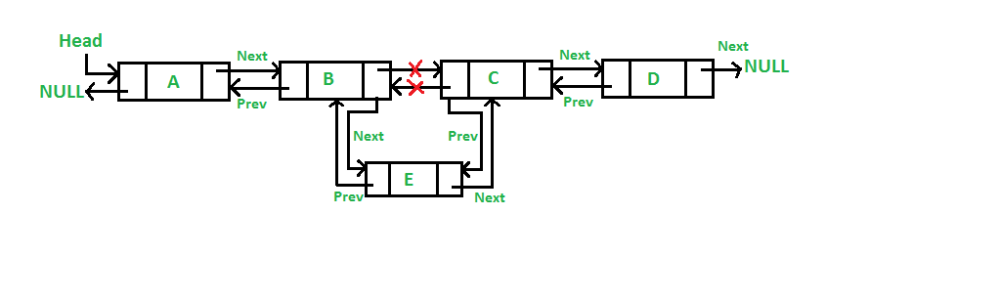

[**<-Back**](/README.md)

# Insertion in Doubly Linked List

Given a Linked List, the task is to insert a new node in this given Linked List at the following positions:

- [**At the font of the linked List.**](#insertFirst)
- [**At the end ot the Linked List.**](#insertend)
- [**After a given node.**](#aftergiven)
- [**Before a given node**](#beforegiven)

<h2 id="insertFirst"> 1 -> Insert a Node at the Font in a Doubly Linked List</h2>

The new node is always added before the head of the given linked of the given Linked List. The task can be performed by using following 5 steps:

    1. Firstly,allocate a New_Node,
    2. Put the require data in the new Node.
    3. Make the next of New_Node point to the current head of the  doubly Linked List.
    4. Make the previous of the current head point to New_Node.
    5. Lastly point head to New_Node

   

## Example

```javascript
class Node {
  constructor(data) {
    this.data = data;
    this.next = null;
    this.prev = null;
  }
}

class DoublyLinkedList {
  constructor() {
    this.head = null;
  }

  InsertFirst(data) {
    const newNode = new Node(data);

    newNode.next = this.head;

    if (this.head !== null) {
      this.head.prev = newNode;
    }

    this.head = newNode;
  }

  print() {
    let current = this.head;
    while (current) {
      console.log(current.data);
      current = current.next;
    }
  }
}

const LinkedList = new DoublyLinkedList();
LinkedList.InsertFirst(10);
LinkedList.InsertFirst(100);
LinkedList.InsertFirst(1000);
LinkedList.InsertFirst(10000);
LinkedList.InsertFirst(100000);
LinkedList.print();
/**
 * Output
 * 100000
 * 10000
 * 1000
 * 100
 * 10
 */
```

<h2 id="insertend"> 2 -> Insert a Node at the End in a Doubly Linked List</h2>

The new node is always added after the last node of the given Linked List. This can be done using the following 7 steps:

    1. Create a New_Node
    2. Put the value in New_Node
    3. Make the next pointer of New_Node as null
    4. If the list is empty, make New_Node as the head
    5. Otherwise, travel to the end of the Linked List
    6. Now make the next pointer of last node point to New_Node
    7. Change the previous pointer of New_Node to the last Node of the list

   

## Example

```javascript
class Node {
  constructor(data) {
    this.data = data;
    this.next = null;
    this.prev = null;
  }
}

class DoublyLinkedList {
  constructor() {
    this.head = null;
  }

  InsertEnd(data) {
    const newNode = new Node(data);
    if (this.head === null) {
      this.head = newNode;
      return;
    }

    let current = this.head;
    while (current.next) {
      current = current.next;
    }
    current.next = newNode;
    newNode.prev = current;
  }

  print() {
    let current = this.head;
    while (current) {
      console.log(current.data);
      current = current.next;
    }
  }
}

const LinkedList = new DoublyLinkedList();
LinkedList.InsertEnd(20);
LinkedList.InsertEnd(200);
LinkedList.InsertEnd(2000);
LinkedList.InsertEnd(20000);
LinkedList.InsertEnd(200000);
LinkedList.print();
/**
 * Output
 * 20
 * 200
 * 2000
 * 20000
 * 200000
 */
```

<h2 id="aftergiven"> 3 -> Insert a Node after a given in a Doubly Linked List</h2>

    1. if target Node is available
       1. Firstly create a New_Node
       2. Now insert the data in the New_Node
       3. The note next to the target note is the new note
       4. Target Note new Note previous Note New Note
       5. The new Note's previous Note is the target Note
       6. The Note next to the new Note is the Note next to the target Note
       7. Change the pointer of the new node's previous pointer to New_Node
    2. if target Node is not available
       1. terminate the process.

   

## Example

```javascript
class Node {
  constructor(data) {
    this.data = data;
    this.next = null;
    this.prev = null;
  }
}

class DoublyLinkedList {
  constructor() {
    this.head = null;
  }

  InsertEnd(data) {
    const newNode = new Node(data);
    if (this.head === null) {
      this.head = newNode;
      return;
    }

    let current = this.head;
    while (current.next) {
      current = current.next;
    }
    current.next = newNode;
    newNode.prev = current;
  }

  InsertAfter(target, data) {
    let current = this.head;
    while (current) {
      if (current.data === target) {
        const newNode = new Node(data);
        newNode.next = current.next;
        newNode.prev = current;
        if (current.next) {
          current.next.prev = newNode;
        }
        current.next = newNode;
        return;
      }
      current = current.next;
    }
    console.error("target not found");
  }
  print() {
    let current = this.head;
    while (current) {
      console.log(current.data);
      current = current.next;
    }
  }
}

const LinkedList = new DoublyLinkedList();
LinkedList.InsertEnd(20);
LinkedList.InsertEnd(200);
LinkedList.InsertEnd(2000);
LinkedList.InsertAfter(200, 5);
LinkedList.InsertAfter(200, 6);
LinkedList.print();
/**
 * Output
 * 20
 * 200
 * 6
 * 5
 * 2000
 */
LinkedList.InsertAfter(900, 6);
LinkedList.print();
/**
 * Output
 * target not found
 */
```

<h2 id="beforegiven"> 4 -> Insert a Node before a given in a Doubly Linked List</h2>

    1. if target Node is available
         1. Create a new node
         2. Set New_Node as the next node target node
         3. New_Node Previous Node Set the previous, previous node of the target node
         4. Target Node previous Node next Note set New_Node.
         5. Target Node Previous Node set New_Node
    2. if target Node not found
       1. terminate the process.

   

## Example

```javascript
class Node {
  constructor(data) {
    this.data = data;
    this.next = null;
    this.prev = null;
  }
}

class DoublyLinkedList {
  constructor() {
    this.head = null;
  }

  InsertEnd(data) {
    const newNode = new Node(data);
    if (this.head === null) {
      this.head = newNode;
      return;
    }

    let current = this.head;
    while (current.next) {
      current = current.next;
    }
    current.next = newNode;
    newNode.prev = current;
  }

  InsertBefore(target, data) {
    let current = this.head;
    while (current) {
      if (current.data === target) {
        const newNode = new Node(data);
        newNode.next = current;
        newNode.prev = current.prev;
        if (current.prev) {
          current.prev.next = newNode;
        }
        current.prev = newNode;
        return;
      }
      current = current.next;
    }

    console.error("target not found");
  }

  print() {
    let current = this.head;
    while (current) {
      console.log(current.data);
      current = current.next;
    }
  }
}

const LinkedList = new DoublyLinkedList();
LinkedList.InsertEnd(20);
LinkedList.InsertEnd(200);
LinkedList.InsertEnd(2000);
LinkedList.InsertEnd(20000);
LinkedList.InsertEnd(200000);
LinkedList.InsertBefore(200, 1);
LinkedList.InsertBefore(200, 2);
LinkedList.InsertBefore(200, 3);
LinkedList.print();

/**
 * Output
 * 20
 * 1
 * 2
 * 3
 * 200
 * 2000
 * 20000
 * 200000
 */
```
