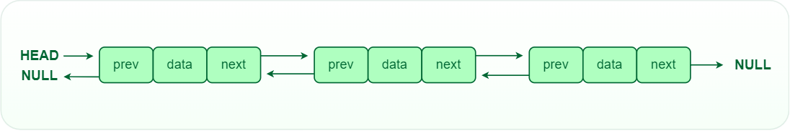

[**<-Back**](/README.md)

# Double Linked List

In a Double Linked List, each node contain references to both the next and previous nodes. This allows for traversal in both forward and backward directions,but it requires additional memory for the backward reference.

   
