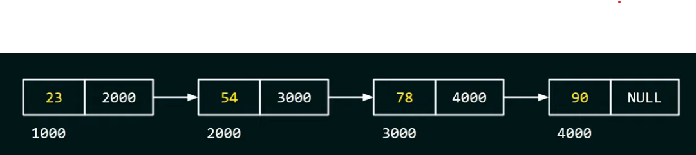

[**<-Back**](/README.md)

# Linked Lists

A Linked list is a linear data structure that stores a collection of data elements dynamically.Each element in a linked list is called a node, and each node consists of two fields:

- **_Data field:_** This field stores the actual data element.
- **_Link field:_** This field stores the address of next node in the list.

The last node in the list has a link field that points to null,which signifies the end of the list.

   

## Types of linked list

**_There are four main types of linked list_**

- **_Singly linked list:_** This is the simplest type of linked list,where each node only contains a data field and a link field to the next node in the list.
- **_Doubly linked list:_** This type of linked list contains an additional link field in each node that points to the previous node in the list.
- **_Circular linked list:_** This type of linked list is similar to a _**singly linked list**_, but the last node in the list points to the first node, forming a loop.
- **_Doubly circular linked list:_** This type of linked list is similar to a _**doubly linked list**_, but the last node in the list points to the first node, forming a loop

### Advantages of linked lists

- **_Dynamic sizing:_** Linked list can grow and shrink dynamically,without having to pre-allocate a fixed amount of memory.This makes them ideal for storing data sets of unknown size.

- **_Efficient insertion and deletion:_** Inserting and deleting elements from a linked list is very efficient, as it only requires updating the link fields of the surrounding nodes.

- **_Memory efficiency:_** Linked lists can be more memory-efficient than arrays,especially for storing sparse data.

### Disadvantages of linked lists

- **_Sequential access:_** Linked lists can only be accessed sequentially, meaning that in order to access a particular element, you must start at the beginning of the list and traverse it until you reach the desired element. This can be inefficient for operations that require random access to elements.

- **_Space overhead:_** Linked lists require additional memory overhead to store the link fields in each node.

#### Example in Javascript

```javascript
// Define a class for a single node in the singly linked list
class Node {
  constructor(data) {
    this.data = data; // Data stored in the node
    this.next = null; // Reference to the next node in the list
  }
}

// Define the SinglyLinkedList class

class SinglyLinkedList {
  constructor() {
    this.head = null;
    this.size = 0;
  }

  // Add a new node end of the list
  append(data) {
    const newNode = new Node(data);

    if (!this.head) {
      // If the list is empty,set the new node as the head
      this.head = newNode;
    } else {
      // Otherwise, find the last node and update its next reference
      let current = this.head;

      while (current.next) {
        current = current.next;
      }
      current.next = newNode;
    }
    this.size++;
  }

  // Print the singly linked list
  print() {
    const result = [];
    let current = this.head;
    while (current) {
      result.push(current.data);
      current = current.next;
    }

    console.log(result);
  }
}

// Example usage:
const singlyLinkedList = new SinglyLinkedList();
singlyLinkedList.append(1);
singlyLinkedList.append(2);
singlyLinkedList.append(3);
singlyLinkedList.print();

// Output : [1,2,3]
```
